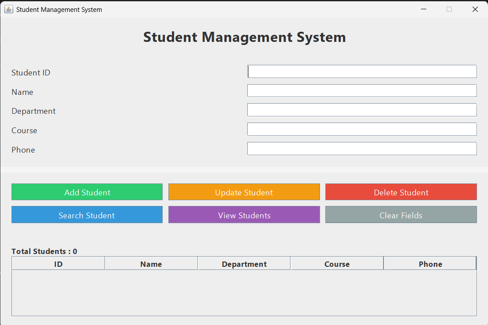

# 🎓 Student Management System

A desktop-based Student Management System developed using Java Swing and SQLite. The application allows users to efficiently manage student records through an intuitive graphical user interface.

---

## ✨ Features

- ➕ Add Student Records
- 🔍 Search Students
- ✏️ Update Student Details
- 🗑️ Delete Student Records
- 📋 View All Students
- 💾 Automatic SQLite Database Creation
- 🎨 User-friendly Java Swing Interface

---

## 🛠 Tech Stack

- Java
- Java Swing
- SQLite
- JDBC
- IntelliJ IDEA

---

## 📂 Project Structure

```
StudentManagementSystem/
│
├── src/
│   └── Main.java
│
├── README.md
└── .gitignore
```

---

## 🚀 Getting Started

### Prerequisites

- Java JDK 17 or later
- IntelliJ IDEA
- SQLite JDBC Driver

### Installation

1. Clone the repository:

```bash
git clone https://github.com/Srushti-1912/Student-Management-System.git
```

2. Open the project in IntelliJ IDEA.

3. Add the SQLite JDBC driver.

4. Run `Main.java`.

5. The application will automatically create `students.db` on the first launch.

---

## 📸 Screenshots

### Home Screen



---

## 📌 Future Improvements

- Login Authentication
- Export Student Data to Excel
- Dashboard Analytics
- Dark Mode

---

## 👩‍💻 Author

**Srushti Shellikeri**

GitHub: https://github.com/Srushti-1912